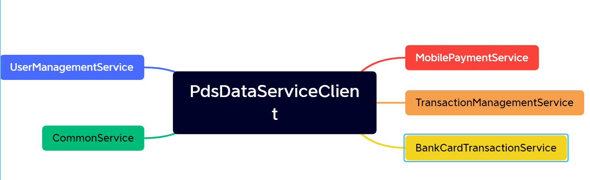
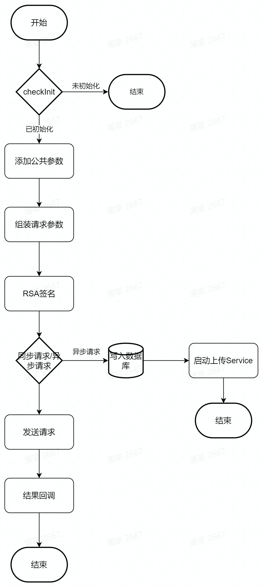

# PayCloud Data Service

##1.接口请求流程

##2.初始化接口init
###1)初始化流程
1. 网络初始化
2. 加载接口服务
3. 保存应用appid和签名key
4. 调用初始化接口
###2).参数
|  参数名   | 说明  |
|  ----  | ----  |
| context  | 上下文 |
| deviceSn  | 设备号 |
| appId  | 应用id |
| privateKey  | RSA私钥 |
| publicKey  | 报文验签公钥 |
| callBack  | 初始化结果回调 |
##3.异步上传策略配置（PdsDataConfig）
1. packetTimeOut,数据发送超时时间，如果超时，则立即上传
2. dataMaxCount，最大缓存条数，如果数据库中缓存调试大于等于设置的最大条数则不在加入缓存。
3. dataMaxReUpLoadCount，最大重传次数，如果缓存数据重传次数大于了最大重传次数，则将缓存从数据库中删除
4. dataMaxReUploadTime，最大重传时间，如果缓存数据超过了最大重传时间，则将缓存从数据库中删除。
5. connectTimeoutSec，网络连接超时时间。